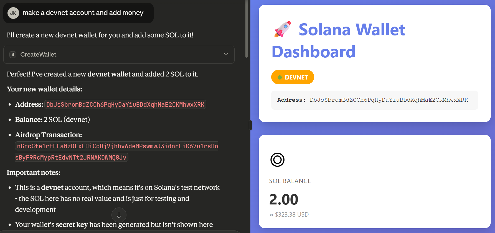
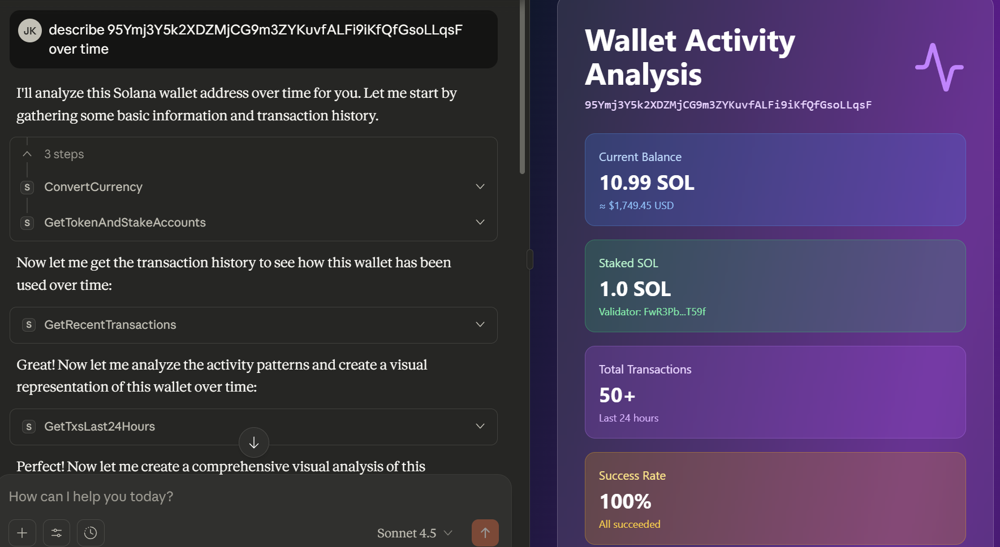
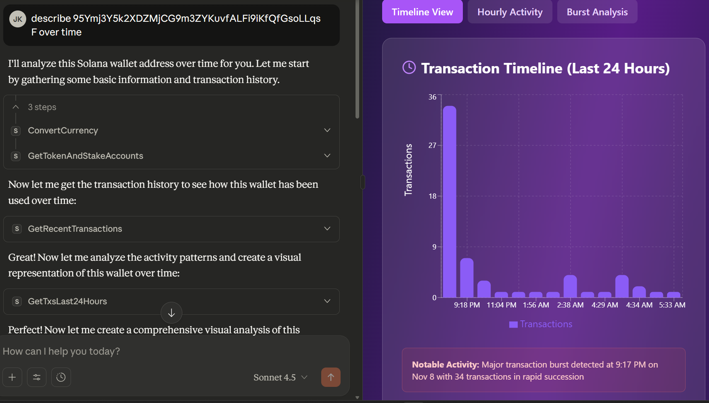
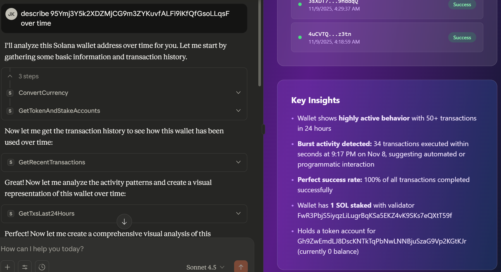
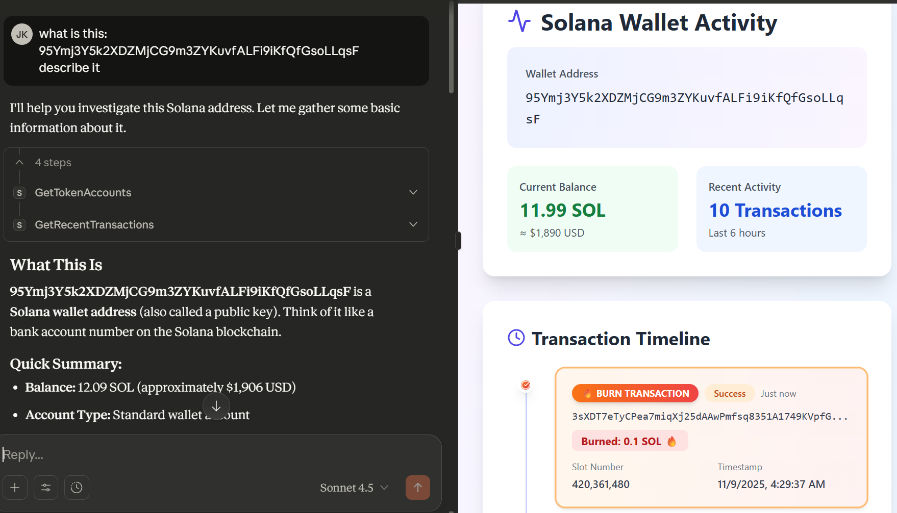

# Solana MCP Server

A Model-Context-Protocol server for interacting with the Solana blockchain. This server provides simple RPC endpoints for common Solana operations.

[Data Analytics Dashboard](https://claude.ai/public/artifacts/4b6653b6-08ef-4bde-ae2d-417073c6ee37)

## Featured Demos








## Features

- getSlot
- getBalance
- getKeypairInfo
- getAccountInfo
- transfer
- requestAirdrop
- runAnchorTests
- getRecentTransactions
- getTokenAccounts
- getTokenAndStakeAccounts
- getTxsLast24Hours
- detectAnomalies
- convertCurrency
- createWallet

## Quickstart

clone and install dependencies:

```bash
git clone https://github.com/yourusername/solana-mcp-server.git
cd solana-mcp-server
npm install
```

build the tool

```bash
npm run build
```

if above doesn't work do this

```bash
wsl
npx tsc
```

add the tool to your claude_desktop_config.json
```
{
  "mcpServers": {
    "solana-rpc": {
      "command": "node",
      "args": [
        "C:\\PATH\\build\\index.js"
      ]
    }
  }
}
```

add these preferences to Claude Desktop
```
keep responses for the layperson, if there is deep technical jargon involved, make sure to explain it. if the prompt includes incorrect terminology explain the relevant blockchain terminology
if the prompt implies basic functionality include: getslot, getbalance, getkeypairinfo (if applicable), getaccountinfo, convertcurrency, gettokenandstakeaccounts of account balance
if the prompt implies data/analysis/summary/history include visual artifacts if the prompt includes explaining/describing/visualizing include visual artifacts
```

# Features

## 🧠 Unique Data Source: 
The Solana Model Context Protocol connects the Claude Desktop AI model directly to live on-chain context from the Solana blockchain, providing balances, NFTs, conversions, and live transaction histories.
This is novel and interesting because blockchain technology is difficult to interact with without Web3 development experience. I recall struggling to connect the various browser extensions, hardware wallets, online IDEs, and test networks when learning about Ethereum.

## 💡 Clever Integration
AI models are very capable of parsing human-level instructions into machine-readable commands. We leverage this by using an MCP to craft a context package that directly touches the live Solana Remote Procedure Call (RPC) URL. 

This not only provides the AI agent with live context but also gives it the ability to manipulate transactions on the blockchain. Essentially, the AI agent + MCP becomes a live human-interactive assistant for the Solana blockchain.

## 🧩 Contextual Intelligence
The MCP server doesn’t just forward data; it infers the intent based on the context of the blockchain and chat history. If you ask for a summary of an address, it provides the current balance, previous transactions, and more on a visually appealing interface.

Additionally, it uses multiple Solana resources such as APIs from Decentralized Exchanges, Price Oracles, and Aggregators. This gives it a complete view of its portfolio, similar to what a crypto analyst would use to make financial decisions.

## 💪 Practical Value
The MCP eliminates the need for network explorers, complex UIs, and complicated setups, allowing any user to manage crypto portfolios straight from Claude Desktop. It completely eliminates jargon and complications, relying purely on conversational dialogue.

This significantly increases accessibility to the blockchain development world for non-technical users. 

## 🧱 Robustness
This tech stack comprises TypeScript and Zod for schema validation, automatic test re-runs within Claude Desktop, and caching of previous messages with structured context templates. And if a data source fails, the MCP handles the fallback, allowing the AI to provide only the relevant information to the user.

This also provides Solana developers with the confidence that their smart programs will perform accurately and correctly. 


## ⚡ Efficiency
Because of gas costs and transaction fees, the MCP server is designed to use as little effort as possible. Given the option to use a network explorer and commit a transaction, the server will choose the cheaper option.


## Demo Prompts

### Start an Account

```
make a devnet account and fund it
```
```
send 1 sol to 95Ymj3Y5k2XDZMjCG9m3ZYKuvfALFi9iKfQfGsoLLqsF then describe the new account
```
```
update the visual
```

### Transact Account
```
describe 95Ymj3Y5k2XDZMjCG9m3ZYKuvfALFi9iKfQfGsoLLqsF
```
```
burn .1 sol using WALLET_KEY
```

### Program Interaction
```
Test this Solana program on devnet using the MCP server:

DEPLOYED PROGRAM ID:
G8XePi8D2k4VSexUNFqc48uVdt6uEhXX3vHqou6yWAkF

WALLET KEYPAIR:
WALLET_KEYPAIR

WORKING DIRECTORY:
C:\Users\jkohh\Downloads\project\anchor-tests

1. Analyze the Rust source code to determine:
   - All function signatures and their parameters
   - All account structures and their fields
   - PDA seeds (if any)
   - Account constraints (#[account(...)])
2. Generate a comprehensive IDL from the source code
3. Create 2 tests 
4. Use CommonJS format with hardcoded values
5. Calculate discriminators from function names
6. Return transaction signatures and verification links

ATTACH HELLO WORLD SOURCE CODE
```
```
describe the program called
```

### Bank Interaction (non deterministic)
 
```
**System:** Windows (not WSL)

**Working Directory:** 
C:\Users\jkohh\Downloads\project\anchor-tests

**Dependencies Installed:**
- @coral-xyz/anchor (v0.29.0)
- @coral-xyz/borsh (v0.29.0)  
- @solana/web3.js (v1.87.0)

**Network:** Solana Devnet (https://api.devnet.solana.com)

**Program ID:** BFjpSGu7uVUgk3F5EJWbhKMqFhnKYK6KyLfqMjsW2YW2

**Wallet Secret Key:**
WALLET_KEY

**Wallet Public Key:** 95Ymj3Y5k2XDZMjCG9m3ZYKuvfALFi9iKfQfGsoLLqsF

**MCP Tool:** Use `solana-rpc:runAnchorTests` with the Windows path above
Test this Solana program using RAW TransactionInstruction (not Anchor Program class):

Network: devnet

source code attached 

Requirements:
- Manual discriminators (SHA256 first 8 bytes)
- Raw web3.js transactions only
- Manual borsh decoding and encoding
- Test: initialize, deposit, withdraw
- Print explorer links
- make it a standalone script instead of using the test framework

Working directory: C:\Users\jkohh\Downloads\project\anchor-tests

run the test and validate the response

ATTACH THE BANK SOURCE CODE
```

## RPC Endpoint

The server connects to Solana's mainnet at `https://api.mainnet-beta.solana.com`. To use a different network (like devnet or testnet), modify the `SOLANA_RPC` constant in `src/index.ts`.
